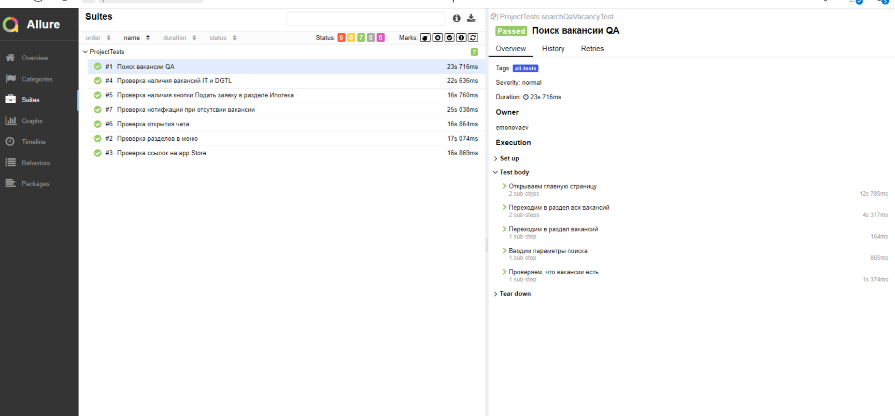

## Проект по автоматизации тестирования для сайта АО «Райффайзенбанк»
## :pushpin: Содержание:

- [Использованный стек технологий](#computer-использованный-стек-технологий)
- [Список авто/ручных тестов](#tests-список-авто/ручных-тестов)
- [Список проверок, реализованных в автотестах](#arrow_forward-запуск-тестов-из-терминала)
- [Запуск тестов из терминала](#arrow_forward-запуск-тестов-из-терминала)
- [Сборка в Jenkins](#сборка-в-jenkins)
- [Пример Allure-отчета](#пример-allure-отчета)
- [Уведомления в Telegram с использованием бота](#уведомления-в-telegram-с-использованием-бота)
- [Видео примера запуска тестов в Selenoid](#-видео-примера-запуска-теста-в-selenoid)

  ## :computer: Использованный стек технологий

<p align="center">


</p>

- В проекте автотесты написаны на языке <code>Java</code> с использованием фреймворка для тестирования [Selenide](https://selenide.org/).
- Cборщик - <code>Gradle</code>.  
- Использован <code>JUnit 5</code> в качестве фреймворка модульного тестирования.
- При прогоне тестов браузер запускается в [Selenoid](https://aerokube.com/selenoid/).
- Для удаленного запуска реализована джоба в <code>Jenkins</code> с формированием Allure-отчета и отправкой результатов в <code>Telegram</code> при помощи бота. 
- Осуществлена интеграция с <code>Allure TestOps</code> и <code>Jira</code>.
  
Содержание Allure-отчета для каждого кейса:
- Шаги теста и результат их выполнения
- Скриншот страницы на последнем шаге (возможность визуально проанализировать, почему упал тест)
- Page Source (возможность открыть source страницы в новой вкладке и посмотреть причину падения теста)
- Логи консоли браузера
- Видео выполнения автотеста.

  
## Список авто/ручных тестов
**Список проверок, реализованных в автотестах**
- [x] Проверка разделов в меню
- [x] Проверка ссылок на app Store
- [x] Проверка открытия чата
- [x] Проверка наличия кнопки Подать заявку в разделе Ипотека
- [x] Проверка наличия вакансий IT и DGTL
- [x] Поиск вакансии QA

**Список проверок ручного тестирования**
- [x] Проверка переключения сайта на английский язык
- [x] Проверка перехода с сайта в Онлайн-банк
- [x] Проверка заголовков меню для корпоративного бизнеса


## :arrow_forward: Запуск автотестов

### Запуск тестов на удаленном браузере
```
gradle clean test запуск всех тестов
```
При необходимости также можно переопределить параметры запуска

```
clean
main -DremoteUrl=${SELENOID_URL}
-DbaseUrl=${BASE_URL}
-DbrowserSize=${BROWSER_SIZE}
-Dbrowser=${BROWSER_NAME}
-Dbrowser_version="${BROWSER_VERSION}"
```

### Параметры сборки

* <code>BROWSER</code> – браузер, в котором будут выполняться тесты. По умолчанию - <code>chrome</code>.
* <code>VERSION</code> – версия браузера, в которой будут выполняться тесты. По умолчанию - <code>100.0</code>.
* <code>SIZE</code> – размер окна браузера, в котором будут выполняться тесты. По умолчанию 1920x1080
* <code>URL</code> – адрес основной страницы тестируемого сайт
* <code>SELENOID</code> – адрес удаленного сервера, на котором будут запускаться тесты.
* TASK (набор тестов для запуска)


## Сборка в Jenkins
<p align="center">

</p>

##  Пример Allure-отчета
### Overview
В отчете отображены пройденные автотесты
<p align="center">

</p>

### Результат выполнения теста

<p align="center">

</p>

##  Интеграция с Allure TestOps

Выполнена интеграция сборки <code>Jenkins</code> с <code>Allure TestOps</code>.
Результат выполнения автотестов отображается в <code>Allure TestOps</code>
На Dashboard в <code>Allure TestOps</code> отображена статистика пройденных тестов.

<p align="center">

</p>

##  Интеграция с Jira

Реализована интеграция <code>Allure TestOps</code> с <code>Jira</code>, в тикете отображается информация, какие тест-кейсы были написаны в рамках задачи и результат их прогона.

<p align="center">

</p>

##  Уведомления в Telegram с использованием бота

После завершения сборки, бот созданный в <code>Telegram</code>, автоматически обрабатывает и отправляет сообщение с результатом.

<p align="center">

</p>

## Видео примера запуска тестов в Selenoid

К каждому тесту в отчете прилагается видео прогона.
<p align="center">
  
</p>

